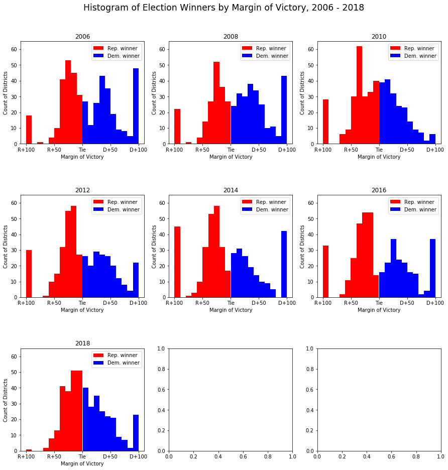

# CS 109A
## Final Project
### Colleen Driscoll, Oliver Mayor and Pooja Tyagi
### 12 December 2018
___

# Overview: Predicting the 2018 Election

Research Question: Which candidates will be elected to the U.S. House of Representatives in 2018?

Provide an overview of the project. It is important that you include a general context for the project as well as an overall description of the project. Any introductory information that’s specific to the project should also be included.

# Motivation: 

Figure 1: "Dewey Defeats Truman" (1948)

Ever since competitive elections have existed, people have tried to predict them. And with good reason -- elections determine the people who will run a town, state, or country for a significant amount of time, and gives those elected the reins of the state to use as they wish. 

Knowing what's at stake, the general public, including heads of households and business leaders look to plan for proposed tax hikes, safety regulations, etc. Having an idea of what the new government will look like before it's set in stone thus allows for a calmer transition between governments. [When parties were less ideological](https://catalog.hathitrust.org/Record/001749434) (such as in Figure 1 above, where president-elect Harry Truman holds up the *Chicago Tribune* [inaccurately] announcing his defeat), predicting elections was interesting but perhaps not extremely consequential, since either party was expected to promote the same kinds of policies. In the increasingly divided and polarized U.S., such questions of government composition become essential. 

Newspapers and universities took up the task of polling voters in both [in their communities](https://law.marquette.edu/poll/) and [across the country](https://poll.qu.edu/). While these polls have played an essential role in drawing up predictions, some polls may be biased due to their participant selection mechanism or question wording. 

When a survey firm uses random-digit dialing, potentially-valid phone numbers are generated by the survey firm at random and called to recruit potential participants. While this method worked well in the past, when everyone had a phone and answered nearly every time, the advent of caller ID meant that fewer people picked up a phone call from a number they did not recognize, and those who did likely constituted a non-random, biased sample of all voters ([Green & Gerber 2002](https://academic.oup.com/poq/article-abstract/70/2/197/1912498)). This non-random sampling makes the poll less reliable as a signal for the actual outcome of the election.

Similarly, different polls may ask what is essentially the same question in different manners. [Research has shown](https://doi.org/10.1086/269158) that the way in which a question is posed to the survey participant affects the respondent's answer. For example, a registered Republican voter, when asked whether she supports John Doe (Dem.) in the governor's race, may answer yes, since she supports his stance on support for young parents. That same respondent, if she is asked whether she supports the Democrat in the governor's race, may think first about her partisan affiliation and second about the actual candidate, and respond no. Thus, given multiple polls whose question wording differs are very difficult to aggregate into any coherent picture of the state of the country.

In the lead-up to the 2008 election, [news media](https://www.nytimes.com/section/upshot) and [newly-minted forecasting agencies](https://fivethirtyeight.com/) began to use statistics to assess polls' accuracy (by predictive power and with reference to other polls). Using a Bayesian approach, the researchers used the prior election result in the district as a prior, and also included information about the survey design (participant selection, question wording, target audience, sample size etc.) to weight the trustworthiness of each poll and ultimately to aggregate them into an overall prediction for each Congressional district (*N* = 435). 

However, the results of the 2016 election did not match those predicted by most analysts. 
Following the 2016 election, the data analytics firm 538 published a [post-mortem](https://fivethirtyeight.com/features/the-real-story-of-2016/) on what went wrong in the production and mass interpretation of their and others' models. 

Figure XXX: New York Times' *Upshot* Election Forecasting Graphic

Figure XXX shows the user interface of the New York Times' election forecast visualizer as it was presented prior to the 2016 election (though not using the predictions the Times' team generated). In the map, each state is presented with its abbreviation and the number of votes it has in the electoral college, the formal body that technically elects the president. Geographically smaller states are presented in the boxes on the right, and states that are allowed to split their electoral college vote between candidates, Maine and Nebraska, are listed in the bottom right. 

The *Times*, as well as several [others](https://www.cookpolitical.com/ratings/house-race-ratings), distinguished the degrees of partisanship here: Districts could be "Strong" Democrat/Republican, "Likely" Democrat/Republican, "Lean" Democrat/Republican, or a toss-up. While this method clearly distinguishes what's likely an uncompetitive race in New York (Strong Democrat), the underlying differences between these groups are opaque to the reader. By obscuring the underlying data and the uncertainty of the predictions that can be made using it, the map does more harm than good. 

Therefore, in this project, we make it a priority to emphasize the uncertainty in our model. It is highly unlikely that we will be able to accurately predict all districts, but it is likely less costly to know that the race is uncertain, than to predict the wrong outcome entirely.

# Description of Data and EDA: 

Due to the nature of politics, all of our data is observational -- without fortuitous exogenous shocks, there is no way to make causal claims about what social or political factors produce an election outcome. Despite this caveat, we explore the correlations between variables and our outcome, whether, for each district, a Democrat or Republican candidate wins in the 2018 Congressional Election.

## Data Selection and Justification

### Political Outcomes

- As our main outcome of interest, we aim to predict which candidate will win the election for each of the 435 races for Congress. Simplifying this, without loss of generality, we model whether the *Democratic* candidate in each district will win; additionally, the two-party nature of politics allows us to operationalize the binary outcome as one where we predict that the Democrat candidate will win the election if her odds of winning are greater than those of the Republican candidate (that is, if the log-odds is greater than zero). In training datasets, if the Democratic proportion of the two-party vote is greater than 0.5, then the Democrat candidate wins.
- (Note: There have been a handful of independent members of the House of Representatives of 435 [no more than two per term]. However, as all of the top candidates 2018 election were either Democrats or Republicans, it is safe to ignore third parties/independent candidates in our analysis). 
- **Data sources:** 
    * 2018 election: At the time of writing, the results of the 2018 Midterm Elections have not yet been published in accessible formats; however, they are available via media outlets online. For this reason, we scraped *Politico*, a trusted online politics website, for the data. Results presented in this project are presented as they stood December 2, 2018, when final scraping was conducted. At this time, in at least two districts, ([North Carolina's Ninth](https://www.nytimes.com/2018/11/30/us/politics/north-carolina-vote-fraud.html) and [California's 21st](https://www.cnn.com/2018/11/28/politics/why-california-is-still-counting-ballots/index.html)), voting irregularities and very close margins mean that these results have not yet been finalized. Whichever candidate was in the lead at this time is recorded as the winner. 
    * 1980 - 2016 outcomes: Data collected based on official records by the [Constituency-Level Elections Archive](http://www.electiondataarchive.org/). Following the modeling plan outlined above, we calculated the Democratic share of the two-party vote for each district across 19 elections. 

Code is attached in the accompanying Jupyter Notebook.

### Political Explanatory Variables

- Candidate data
   * Incumbency status:  [Much research in political science](https://www.jstor.org/stable/2111475) has shown the large positive effect on a candidate's chances of being elected if she is the current holder of the seat (the incumbent). Taking this into account, we create a binary variable for whether the incumbent is running in the election. Next, we combine this binary variable with another that indicates whether the incumbent is a Democrat or Republican, forming an interaction term. When the interaction term indicates that there is a Democratic incumbent running for re-election, we expect predicted Democratic vote share to be higher. When there is a Republican incumbent running for re-election, we expect Democratic vote share to be lower.
   * Ideological position(s): Political scientists have developed techniques to estimate the ideological position of elected representatives, especially those in Congress. [Poole and Rosenthal](https://voteview.com/about) have developed DW-NOMINATE (Dynamic Weighted NOMINAl Three-step Estimation) scores, which are an aggregate measure of a Congressmember's lifetime public voting record in office over two dimensions, which broadly reflect differences in preferences on economic and social policy. We also include the [Nokken-Poole score](https://onlinelibrary.wiley.com/doi/abs/10.3162/036298004X201294), which does not make assumptions about ideological stability in members of Congress over time, allowing for more fluctuations within the same legislator over time. Both measures provide for different understandings of the ideology of the incumbent (essentially, how long a memory constituents have); thus, we include both in our dataset.

- Contextual data
    * District prior vote share: For each district, we have a long record of voting. It is likely the case that a district's partisanship, as measured by its most recent vote results, predicts the next future results very well. However, politics is cyclical and all data is subject to random variation. Thus, we include results from multiple years prior to 2018 to train the model. A potential issue with this is the changing nature of districts over time due to redrawing of district boundaries (redistricting).

## Socio-economic Data

Here, we utilize data from the [American Community Survey](census.gov) (ACS), which collects demographic and economic information about 1% of the U.S. population each year. This information is also presented at the level of the Congressional district, making our anlaysis more straightforward. Unfortunately, however, the ACS the only started collecting data at this level in 2005, and other public datasets do not present their data at the level of the Congressional district prior to 2005. Moreover, due to the ['creative' drawing](https://en.wikipedia.org/wiki/Gerrymandering_in_the_United_States) of some district boundaries, it is virtually impossible to map county-level variables to Congressional district variables. 

Our variables of interest are as follows:

- **Unemployment Rate**: What percent of people *want* a job but do not have one, for each district? Measures economic stagnation/discontent in a district. When unemployment is higher, we expect the majority party to do more poorly in the next election. ([Arzheimer 2009](https://doi.org/10.1111/j.1540-5907.2009.00369.x)).
- **Median Household Income, Median Mortgage Cost**: Political scientists have long established the connection between income/wealth and voting (cf. [Evans & Tilley 2012](http://journals.cambridge.org/abstract_S0007123411000202)). Left-wing parties tend to support higher levels of income and wealth redistribution; thus, the poor/less wealthy tend to vote for the parties on the economic left, broadly, and the rich/more wealthy tend to vote for parties on the economic right. Here, median mortgage cost proxies for the median wealth in the district, since many [Americans' most valuable asset is their home](http://www.pewsocialtrends.org/2011/07/26/chapter-5-which-assets-are-most-important/). Thus, we expect districts with higher median incomes and/or higher mortgage costs to favor Republicans over Democrats in elections. 
- **Median Age**: 
- **Percent White**:
- **Percent Black**:
- **Highest Education, High School Diploma**:
- **Highest Education, Bachelor's Degree**:

Using ACS data starting in 2005, we have 435 districts * 6 elections = 2610 election observations prior to the 2018 election. While this is a sufficiently high number of observations to train basic models on, as models become significantly more complex, we may run into issues with overfitting to the training set. We take care to limit such problems by not using very high degree polynomials and through regularization, discussed below.

None of our data had missing values, though the estimates that the ACS makes are based at least partially on hot-deck imputation of missing values. The ACS describes hot-deck encoding as a method by which "sampled units are ordered by some frame variables and a unit’s missing items are assigned from a unit – usually the nearest unit in the ordered frame list – within the subset of 'donors' defined as units sharing certain geographic, frame, and possibly demographic attributes with the unit to be imputed ([Wright et al. 2015, p.7](https://www.census.gov/content/dam/Census/library/working-papers/2015/acs/2015_Slud_01.pdf)).  
Essentially, the Census Bureau matches missing observations on non-missing observations using observable characteristics present in both respondents, and imputes the missing value probabalistically, given a set of potential matches. It is unclear to what extent this imputation affects our findings, but given that we are only looking at top-level variables within each district, these issues should be minimal.

## Exploratory Data Analysis

### District-level variables

Figure XXX  

### National-level variables

Figure XXX: 

Above, we see the percent seats held by Democrats in the House over time and under Presidents from different parties. This plot shows the midterm advantage enjoyed by the non-presidential party in American politics -- at midterm elections (two years after the President was [re-]elected), voters tend to support the party in opposition. This is seen in the graph above by steep drop-offs in the proportion of House seats held be Democrats 1994-1996 and 2008-2010. Additionally, Republicans lost a large share of seats 1982-1984 and 2006-2008.

In terms of modeling, this suggests that we include a dummy variable indicating whether the election was a Presidential or midterm election, which we do in the models below. Given that the 2018 election is a midterm election under a Republican President, we expect the Democratic Party (the opposition party) to gain seats this election.

Figure XXX: 

### Summary of EDA

Figure XXX: 

# Modeling Approach:

Our baseline model for predicting the results of the 2018 election is a logistic model predicting whether a Democrat won, using the district's prior election results as the sole predictors. We work under the assumption that we do not know the results of the 2018 election yet, and have to make a predictive model for them. To do this, we git a baseline logistic regression model to the 2016 outcome, based on the district's prior vote share in all of the previous elections for which we have complete data.

Mathematically, this is: $P(D_{win} =1) = (1+e^{-\beta X + c})^{-1}$, where $\beta$ is composed of the combined results of each election between 2004 and 2014.

Using this simple model, we can predict the 2018 results with 86.9% accuracy.

What further models did you implement? 

**Time effects**

It is likely that the results of more recent elections predict the 2018 outcome better than do those from earlier years. This might be due to factors such as incumbency, changes in ideology, or changes in racial/ethnic makeup. For this reason, we include an interaction term between the prior vote results and the year in which that result occurred.

Description of your implementations beyond the baseline model. Briefly summarize any changes in your project goals or implementation plans you have made along the way. These changes are a natural part of any project, even those that seem the most straightforward at the beginning. The story you tell about how you arrived at your results can powerfully illustrate your process.

# Results: 

## Baseline Model
It is striking to the researchers that even with no additional covariates besides the district's past eight election results, the predictive accuracy of the model is 86.9%. Moreover, this prediction on the test set is over 5 points higher than the training set accuracy, which is 81.57%. It appears that the 2016 election may have been anomalous while 2018 was more of a 'normal' election where traditional predictors were better at predicting the outcome. 

Additionally, we see in Figure XXX, that the results are not a simple mapping from prior vote share to predicted vote share -- it does not appear to be true that a district's election result can be assumed to be exactly the same as the past result. Specifically, the model only predicts the Democrat to win the election if the Democrat won the past election by at least ten points (Democrat vote share at least 55%), and predicts the winner to be Republican for the remaining cases. 

Our likely theory for the success of this model is that since prior election results are themselves products of the characteristics of the districts and of the representatives who are elected from them, the effects of many of the other predictors are already present in the prior voting reuslts. 

This effect is shown graphically in Figure XXX above for a two-period case. In this example, the result of the election in 2016 is dependent on the racial makeup and voter wealth in that year. Since district wealth and racial makeup of a district are slow to change, these values in 2016 are likely to be very similar to those in 2018. Therefore, the 2016 election results are extremely good predictors for the 2018 results, since the prior results are the products of innumerable district-level variables that help predict the results of elections, regardless of other time-sensitive predictors. 

Describe the results and emphasize the most important results. Did you have to reconsider some of the original assumptions?

__DISCUSS REGULARIZATION__

## Extended Models

### Discussion on model selection and implementation

Our goal of predicting the result of the midterm elections is essentially a binary classification problem with two classes (Democrat win = 1 and Republican win = 0). We have a number of choices in terms of which classification model to choose, including linear or quadratic discriminant analysis, k-nearest neighbours, decision trees or logistic regression. Given that are dataset is relatively small with 435 districts and would lead to a reasonable computational time, we decided not to use discriminant analyses.  The benefit of the simplicity of k-nearest neighbours is also limited given the nature of our dataset. Therefore, we decided to use Logistic regression and its variants to model our data. In addition, we explored the performance of decision trees (bagging and random forest) for comparison. 

The performance of the various models in our analysis is summarized in Table XXX. The models were all trained on the data from 2005 – 2016 and then used to predict the results for 2018. The model that gave the best predictions is Logistic regression with power and interaction terms. Therefore, the results presented in this report are based on the predictions from this model.

|classifier|training accuracy|test accuracy|
|-----|-----|-----|
|Logistic Regression|0.910281|0.896552|
|Logistic Regression with CV (Lasso)|0.896552|0.896552|
|Logistic Regression with CV (Ridge)|0.907971|0.896552|
|Linear Regression (Ridge)|0.914132|0.905747|
|Bagging|0.993454|0.896552|
|Random Forest|0.998845|0.896552|
|Logistic with Power terms and Interactions|0.915671|0.905747|

We further analyze this model below.

Figure XXX: 

In Figure XXX above, we show the predicted probabilities from the model on the test set by the value of the untransformed predictor set. As we can see, there are only a few cases where 2018 predictor values were especially bad at predicting the outcome, as evidenced by clusters of inaccurate predictions in one region of the graph. We see, for the most part, the model predicted the wrong outcome only in very close races (near ties), where other factors, such as [rain on election day](https://www.journals.uchicago.edu/doi/abs/10.1111/j.1468-2508.2007.00565.x), might have suppressed turnout in an unpredictable way.

One pattern that appears in this analysis is the relationship between economic ideology (`nokken_poole_dim1`) and prediction accuracy. It appears that the model performed especially poorly among moderate to mainstream Republican members of Congress. For districts whose members were between +0.20 and +0.40 (i.e. moderate to mainstream Republicans), the model predicted that they would win, while actually, they lost. This finding supports the observation in the media that the 2018 election would be a "[blue wave](https://www.nytimes.com/interactive/2018/11/07/us/politics/how-democrats-took-the-house.html)"-- 

Finally, these plots show us the limitations of using only demographic and political information without supplementing it with polling data. 

# Conclusions and Summary:

Review what was discussed in the Overview and Motivation sections (don’t repeat them word-for-word!). Discuss your contributions including the successes and areas for improvement.

Our model was over 90 percent accurate in predicting the results of the 2018 midterm elections. Given that the highest accuracy achieved by psephologists is 95 percent, we are relatively happy with the performance of our model. A closer look reveals what may have made a difference in the accuracies of our model as compared to the best available model. We find that one important predictor that was used in their model was the past years' polling data which is not easily available for us to use. 

Another point to note is that the model they used was elastic net regularization which, in essence, is a combination of ridge and lasso regularization methods. We tried each of these regularization methods separately but did not find them to be better than our logistic model. Perhaps with several more significant predictors, we would have seen an improvement over our model using regularization methods.

# Future work: 

Discuss extensions to and new directions for your work. What do you think would be interesting to pursue next? Are there any ideas worth exploring that you didn't get a chance to explore?

https://fivethirtyeight.com/features/how-fivethirtyeights-2018-midterm-forecasts-did/

For future work, it would be interesting to see the effect of adding several more significant predictors to our data set such as past years' polling data. In terms of modeling, depending on size of the data set, we could explore discriminant analyses and elastic net regularization methods.
