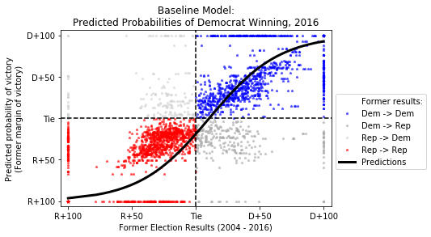

# CS 109A
## Final Project
### Colleen Driscoll, Oliver Mayor and Pooja Tyagi
### 12 December 2018
___

# Overview: Predicting the 2018 Election

Research Question: Which candidates will be elected to the U.S. House of Representatives in 2018?

Provide an overview of the project. It is important that you include a general context for the project as well as an overall description of the project. Any introductory information that’s specific to the project should also be included.

# Motivation: 

Introduce the project motivation both as a whole as well as motivations for important defining aspects of your work. For example were there any visualization or UI primitives that informed your work?

In the lead-up to the 2016 election, news media and 

However, the results of the 2016 election did not match those predicted by most analysts. 
Following the 2016 election, the data analytics firm 538 published a [post-mortem](https://fivethirtyeight.com/features/the-real-story-of-2016/) on what went wrong in the production and mass interpretation of their and others' models. 

Figure XXX shows the user interface of the New York Times' election forecast visualizer as it was presented prior to the 2016 election (though not using the predictions the Times' team generated). The *Times*, as well as several [others](https://www.cookpolitical.com/ratings/house-race-ratings) 

Describe the numbers and "legend"

# Description of Data and EDA: 

What data are you dealing with? 

## Data Selection and Justification

**Political Outcomes**

- As our main outcome of interest, we aim to predict which candidate will win the election for each of the 435 races for Congress. Simplifying this, without loss of generality, we model whether the *Democratic* candidate in each district will win; additionally, the two-party nature of politics allows us to operationalize the binary outcome as one where we predict that the Democrat candidate will win the election if her odds of winning are greater than those of the Republican candidate (that is, if the log-odds is greater than zero). In training datasets, if the Democratic proportion of the two-party vote is greater than 0.5, then the Democrat candidate wins.
- (Note: There have been a handful of independent members of the House of Representatives of 435 [no more than two per term]. However, as all of the top candidates 2018 election were either Democrats or Republicans, it is safe to ignore third parties/independent candidates in our analysis). 
- **Data sources:** 
    * 2018 election: As of writing, the results of at least one Congressional district have not yet been finalized; upon the certification of all results, the test set data will be compiled either from official state election boards or downloaded from other academics/media.
    * 1980 - 2016 outcomes: Data collected based on official records by the [Constituency-Level Elections Archive](http://www.electiondataarchive.org/). Following the modeling plan outlined above, we calculated the Democratic share of the two-party vote for each district across 19 elections. 

**Political Explanatory Variables**

- Candidate data
   * Incumbency status:  [Much research in political science](https://www.jstor.org/stable/2111475) has shown the large positive effect on a candidate's chances of being elected if she is the current holder of the seat (the incumbent). Taking this into account, we create a binary variable for whether the incumbent is running in the election. Next, we combine this binary variable with another that indicates whether the incumbent is a Democrat or Republican, forming an interaction term. When the interaction term indicates that there is a Democratic incumbent running for re-election, we expect predicted Democratic vote share to be higher. When there is a Republican incumbent running for re-election, we expect Democratic vote share to be lower.
   * Ideological position(s): Political scientists have developed techniques to estimate the ideological position of elected representatives, especially those in Congress. [Poole and Rosenthal](https://voteview.com/about) have developed DW-NOMINATE (Dynamic Weighted NOMINAl Three-step Estimation) scores, which are an aggregate measure of a Congressmember's lifetime public voting record in office over two dimensions, which broadly reflect differences in preferences on economic and social policy. We also include the [Nokken-Poole score](https://onlinelibrary.wiley.com/doi/abs/10.3162/036298004X201294), which does not make assumptions about ideological stability in members of Congress over time, allowing for more fluctuations within the same legislator over time. Both measures provide for different understandings of the ideology of the incumbent (essentially, how long a memory constituents have); thus, we include both in our dataset.

- Contextual data
    * District prior vote share: For each district, we have a long record of voting. It is likely the case that a district's partisanship, as measured by its most recent vote results, predicts the next future results very well. However, politics is cyclical and all data is subject to random variation. Thus, we include results from multiple years prior to 2018 to train the model. A potential issue with this is the changing nature of districts over time due to redrawing of district boundaries (redistricting). In the next Milestone, we will have a systematic method to deal with redistricting, based on weighting results from districts that once composed the current district. 

**Socio-economic Data**

In the next Milestone, we present data from the [American Community Survey](census.gov). There, we obtain variables on median district age, unemployment rate, household income, educational attainment, and racial/ethnic backgrounds. Regression results using these covariates are not presented at this stage; however, summary statistics are, and these variables will be incorporated in the final model to maximize predictive power. 

What methods have you used to explore the data (incl. initial explorations, models, data cleansing and reconciliation, etc)? 
__What insights did you gain? How did those methods influence your work?__

## Exploratory Data Analysis

### District-level variables

### National-level variables

Above, we see the percent seats held by Democrats in the House over time and under Presidents from different parties. This plot shows the midterm advantage enjoyed by the non-presidential party in American politics -- at midterm elections (two years after the President was [re-]elected), voters tend to support the party in opposition. This is seen in the graph above by steep drop-offs in the proportion of House seats held be Democrats 1994-1996 and 2008-2010. Additionally, Republicans lost a large share of seats 1982-1984 and 2006-2008.

In terms of modeling, this supports the inclusion of a dummy variable indicating whether the election was a Presidential or midterm election. Given that the 2018 election is a midterm election under a Republican President, we expect the Democratic Party (the opposition party) to gain seats this election.

## Outcome
At the time of writing, the results of the 2018 Midterm Elections have not yet been published in accessible formats; however, they are available via media outlets online. For this reason, we scraped *Politico*, a trusted online politics website, for the data. Results presented in this project are presented as they stood December 2, 2018, when final scraping was conducted. At this time, in at least two districts, ([North Carolina's Ninth](https://www.nytimes.com/2018/11/30/us/politics/north-carolina-vote-fraud.html) and [California's 21st](https://www.cnn.com/2018/11/28/politics/why-california-is-still-counting-ballots/index.html)), voting irregularities and very close margins mean that these results have not yet been finalized. Whichever candidate was in the lead at this time is recorded as the winner. 

Code is attached in the accompanying Jupyter Notebook.

# Literature Review/Related Work:

This can include noting any key papers, texts, other software sources, talks or websites that you have used to develop your modeling approach and/or that informed your demo/site.

# Modeling Approach:

What was your baseline model for comparison? 

Our baseline model for predicting the results of the 2018 election is the district's prior election results. 

Mathematically, this is: $P(D_{win} =1) = (1+e^{-\beta X + c})^{-1}$, where $\beta$ is composed of the combined results of each election between 1980 and 2016.

Using this simple model, we can predict the 2018 results with 75.15% accuracy.
dr

What further models did you implement? 

It is likely that the results of more recent elections predict the 2018 outcome better than do those from earlier years. This might be due to factors such as incumbency, changes in ideology, or changes in racial/ethnic makeup. For this reason, we include an interaction term between the prior vote results and the year in which that result occurred.

Description of your implementations beyond the baseline model. Briefly summarize any changes in your project goals or implementation plans you have made along the way. These changes are a natural part of any project, even those that seem the most straightforward at the beginning. The story you tell about how you arrived at your results can powerfully illustrate your process.

# Results: 

Describe the results and emphasize the most important results. Did you have to reconsider some of the original assumptions?

# Conclusions and Summary:

Review what was discussed in the Overview and Motivation sections (don’t repeat them word-for-word!). Discuss your contributions including the successes and areas for improvement.

# Future work: 

Discuss extensions to and new directions for your work. What do you think would be interesting to pursue next? Are there any ideas worth exploring that you didn't get a chance to explore?

